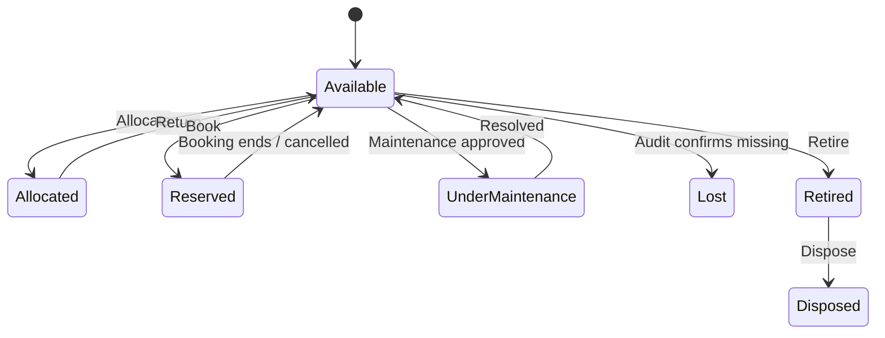
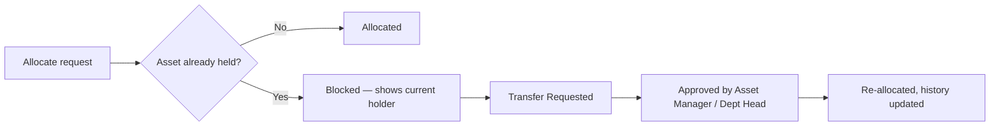
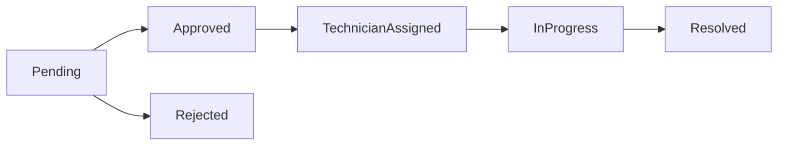

<div align="center">

# AssetFlow

### Enterprise Asset & Resource Management System

Track, allocate, and maintain physical assets and shared resources through one centralized ERP platform.


</div>

---

## Table of Contents

- [Why](#why)
- [Features](#features)
- [User Roles](#user-roles)
- [Core Workflows](#core-workflows)
- [Tech Stack](#tech-stack)
- [Project Structure](#project-structure)
- [Getting Started](#getting-started)
- [API Overview](#api-overview)
- [Team](#team)

---

## Why

Most organizations still track equipment, furniture, vehicles, and shared spaces in spreadsheets and paper logs. AssetFlow replaces that with structured asset lifecycles, centralized resource booking, conflict-safe allocation, an approval-gated maintenance workflow, and scheduled audit cycles — all with role-based access and a live KPI dashboard.

It is not tied to any single industry. Any organization with equipment, furniture, vehicles, or shared spaces — offices, schools, hospitals, factories, agencies — can use it. Purchasing, invoicing, and accounting are deliberately out of scope; this is about knowing **who holds what, where it is, and its condition**.

---

## Features

| Module | What it does |
|---|---|
| Organization Setup | Departments (with hierarchy), asset categories (with custom fields), employee directory |
| Asset Registry | Register, search, and filter assets by tag, serial number, category, status, department, or location |
| Allocation & Transfer | Allocate to employee/department with conflict blocking; structured transfer requests; return with condition check-in |
| Resource Booking | Time-slot booking of shared resources with automatic overlap rejection |
| Maintenance | Approval-gated repair workflow with technician assignment and status history |
| Audit Cycles | Scoped, multi-auditor verification cycles with auto-generated discrepancy reports |
| Dashboard & Notifications | Live KPIs, overdue tracking, and a full activity log |

---

## User Roles

| Role | Capabilities |
|---|---|
| **Admin** | Manages departments, asset categories, audit cycles, and employee/role assignment; views org-wide analytics |
| **Asset Manager** | Registers and allocates assets; approves transfers, maintenance requests, returns, and audit discrepancies |
| **Department Head** | Views assets allocated to their department; approves allocation/transfer requests within it; books shared resources on the department's behalf |
| **Employee** | Views assets allocated to them; books shared resources; raises maintenance requests; initiates returns/transfers |

Roles are never self-assigned. Signup only ever creates an `Employee` account — an Admin promotes existing employees to Department Head or Asset Manager from the Employee Directory. That is the only place roles change.

---

## Core Workflows

**Asset lifecycle**



**Allocation conflict → transfer**



**Maintenance approval**



---

## Tech Stack

**Frontend** — React 19, Vite, React Router 7, Axios, Chart.js (via `react-chartjs-2`), `date-fns`, `lucide-react`
**Backend** — Node.js, Express, `better-sqlite3` (SQLite), JWT auth (`jsonwebtoken`), `bcryptjs`, `multer`
**Linting** — `oxlint`

---

## Project Structure

```
Odoo/
├── client/                    React + Vite frontend
│   └── src/
│       ├── api/client.js      Axios instance
│       ├── components/        Layout, Header, Sidebar, Modal, StatusBadge, ProtectedRoute
│       ├── context/           AuthContext, NotificationContext
│       └── pages/             Login, Signup, Dashboard, OrgSetup, AssetDirectory,
│                               AssetAllocation, ResourceBooking, Maintenance,
│                               AssetAudit, Reports, ActivityLogs
├── server/                    Express + SQLite backend
│   ├── db/                    schema.js (tables), seed.js (demo data)
│   ├── middleware/            auth.js (JWT), rbac.js (role guards)
│   └── routes/                auth, departments, categories, employees, assets,
│                               allocations, bookings, maintenance, audits,
│                               reports, notifications, logs
└── package.json                Root scripts (concurrently runs client + server)
```

---

## Getting Started

### Prerequisites

- Node.js 18+
- npm

### Install

```bash
npm run install:all
```

Installs the root, `server`, and `client` dependencies in one shot.

### Run (dev)

```bash
npm run dev
```

Starts the Express API on `http://localhost:3001` and the Vite dev server on `http://localhost:5173` concurrently. The SQLite database (`server/assetflow.db`) is created and seeded automatically on first run — no manual migration step needed.

### Build for production

```bash
npm run build
```

<details>
<summary><strong>Demo credentials</strong> (seeded on first run)</summary>

| Email | Password | Role |
|---|---|---|
| `admin@assetflow.com` | `admin123` | Admin |
| `sarah@assetflow.com` | `password123` | Asset Manager |
| `michael@assetflow.com` | `password123` | Department Head |
| `priya@assetflow.com` / `raj@assetflow.com` / `emily@assetflow.com` / `david@assetflow.com` / `lisa@assetflow.com` | `password123` | Employee |

</details>

<details>
<summary><strong>Environment variables</strong> (optional)</summary>

| Variable | Default | Purpose |
|---|---|---|
| `PORT` | `3001` | API server port |
| `JWT_SECRET` | dev fallback in `middleware/auth.js` | Set this in any real deployment — don't ship the default |

</details>

---

## API Overview

All routes are mounted under `/api`.

<details>
<summary><strong>Route table</strong></summary>

| Base path | Purpose |
|---|---|
| `/api/auth` | Signup, login, forgot password, session validation |
| `/api/departments` | Department CRUD, hierarchy |
| `/api/categories` | Asset category CRUD, custom fields |
| `/api/employees` | Employee directory, role promotion |
| `/api/assets` | Asset registration, search, lifecycle status |
| `/api/allocations` | Allocation, transfer requests, returns |
| `/api/bookings` | Resource bookings, overlap validation |
| `/api/maintenance` | Maintenance request workflow |
| `/api/audits` | Audit cycles, verification, discrepancy reports |
| `/api/reports` | KPIs and analytics |
| `/api/notifications` | In-app notifications |
| `/api/logs` | Activity log |
| `/api/health` | Health check |

</details>

Every route beyond `/api/auth` requires a valid JWT and is further gated by role via the `rbac` middleware.

---

## Team

Built by **Pragyan**, **Aman**, **Sumit**, and **Shiv** at the Odoo hackathon.
